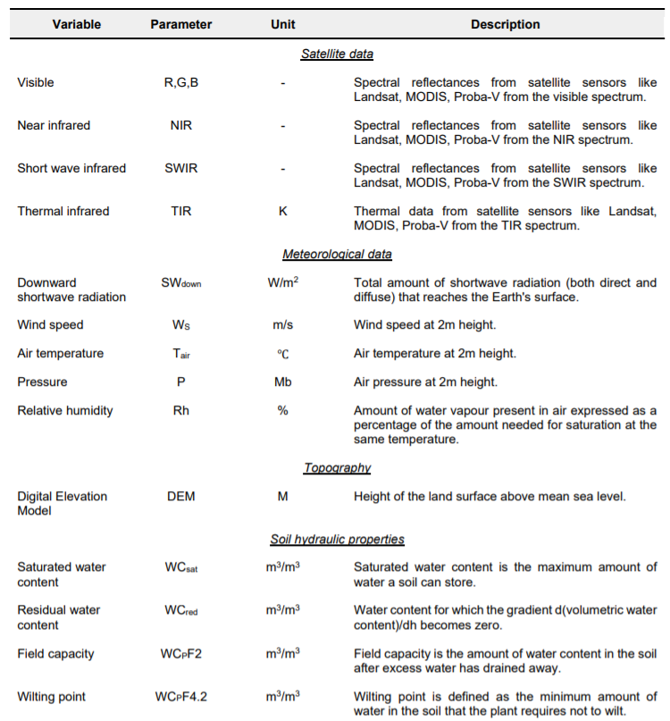
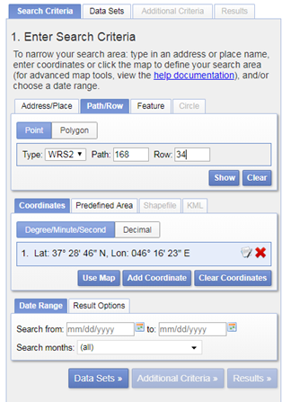
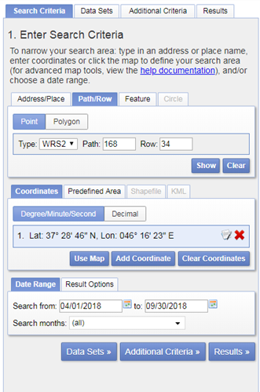
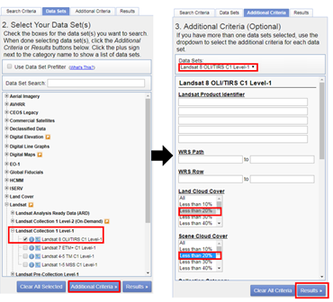
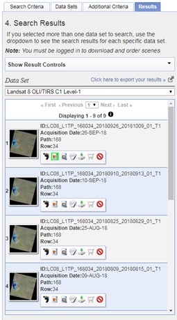
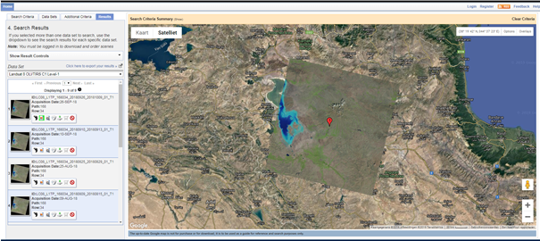
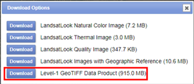
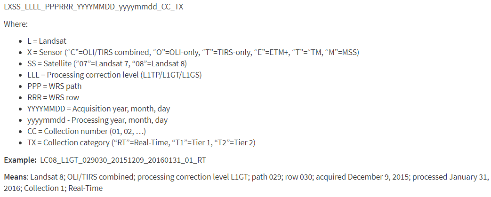
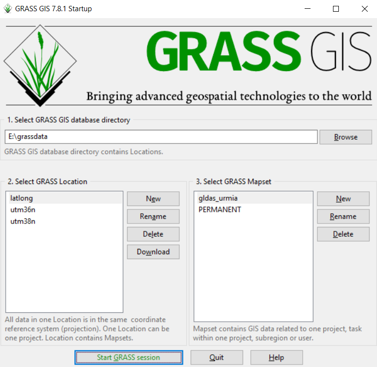

PySEBAL data requirements
*************************

To run PySEBAL we need the following input data as shown below in the figure.

   
   List of input data required for PySEBAL

Satellite data
==============

Currently PySEBAL support data from Landsat 4/5/7/8, MODIS, PROBA-V/VIIRS sensors/satellites.
In this documentation currently PySEBAL using Landsat data as input is explained. But data from other satellites can be easily used by replacing the Landsat data,

Acquiring Landsat data
++++++++++++++++++++++
The main archive of Landsat satellite (all missions – TM/ETM/OLI) is earth explorer website: https://earthexplorer.usgs.gov/. 

.. note::

   First step is to create user login for this website so that you are able to download the data.

Let us now search and download data for Miandoab irrigation scheme in Iran for the time period April to September 2018.

**Step1**

In the “Search Criteria” tab type in your “address/place” of your interest, in this case “Miandoab” and click “enter” or search for Path/row - 168/034.

   Setting the search criteria

Click on the result (red box) and a location popup will appear over on the map.

**Step2**

Now enter the date range for which data is required in the same tab.

   Setting the date range

**Step3**

Select the datasets you want to search and set the additional criteria of those data with cloud cover less than 20%

   Setting additional criteria and listing results

Here we are selecting only Landsat 8 data. For previous years you can also try with Landsat 7 ETM, and Landsat 4/5 TM. Finally click the “Results” to see list of all available data with our conditions met for the study area in the given period of time.

**Step4**

Check the listed scenes using browse images, select and download the 168/034 scene

   List of available landsat 8 data for the given period of time

The image icon under each result can be used to see the preview of that landsat scene (see Figure above). The download icon can be used to download that single scene with out ordering. While the Bulk download icon can be used to get a single link to download multiple products at a time. More details on bulk download can be found here - https://www.usgs.gov/media/videos/eros-earthexplorer-how-do-a-bulk-download.

   
   Showing the preview image of a landsat scene

For example, image dated 22 June 2018 looks really good, click on the download icon to get the data. You have to login in order to download the data.

   Landsat download options, select the one highlighted

From the list of options download the “Level-1 GeoTIFF Data Product” to get all the spectral bands and metadata of the scene.

Bulk download Landsat data using command line
+++++++++++++++++++++++++++++++++++++++++++++

This section explains how you can download big amount of Landsat data from Google cloud bucket using command line.

**Steps**

* Install gsutil library - https://pypi.org/project/gsutil/
* If you want to list all the Landsat 8 data over Miandoab covering tile 168/034 in June 2018 use the following command:

.. code-block:: Shell
   :linenos:

   gsutil ls -d gs://gcp-public-data-landsat/LC08/01/168/034/LC08_L1TP_168034_201806*T1

* To download them, use the following command:

.. code-block:: Shell
   :linenos:
   
   # '.' means it will download to present directory
   gsutil -m cp -r gs://gcp-public-data-landsat/LC08/01/168/034/LC08_L1TP_168034_201806*T1 .

This `link <https://shuzhanfan.github.io/2018/05/download-landsat8-data-from-google-cloud/>`_ has more details on this approach.

Naming convention of Landsat data
++++++++++++++++++++++++++++++++++++++++++++

   Landsat data naming convention

Meteo data
==========

Meteo data is either obtained from field stations or from global models like GLDAS, ERA5, MERRA2 etc.
Here we will use instantaneous and daily average computed from GLDAS data. You can download 3 hourly GLDAS data from this web link: https://hydro1.gesdisc.eosdis.nasa.gov/data/GLDAS/GLDAS_NOAH025_3H.2.1/

Once downloaded the data, we use GDAL and GRASS GIS to compute the required meteo parameters for PySEBAL.

The GLDAS data is provided in netCDF4 format with number of measured parameters as subdatasets. Let us assume that you have downloaded the GLDAS data for the 6 June 2018 00:00 hours.

The file name will be ``GLDAS_NOAH025_3H.A20180606.0000.021.nc4``.

Now let us do all the processing in GDAL library and GRASS GIS already installed in your system.

Open **OSGeo4W Shell**
Type ``grass78 --gui`` and enter
It will open the following interface

   GRASS GIS start window, set DB, Location and Mapset here.

For an introduction to GRASS GIS see this `presentation <https://gitpitch.com/veroandreo/grass_opengeohub2019/master?p=slides/intro>`_.

Before we proceed with GRASS GIS we will set the linux environment in the OSGeo4W Shell. Please download this `file <https://github.com/spareeth/PySEBAL_doc/blob/version3.7.3/.bashrc>`_ and save in ``echo $HOME`` folder. Please change line no: 22 in this file ``.bashrc`` only the ``/c/OSGeo4W64/apps/grass/grass78/scripts`` to the corresponding path in your computer. 

.. code-block:: Shell
   :linenos:

    # Start the Linux bash
    bash

.. warning::

   In the export path above, adapt your path accordingly. If your OSGeo4W installation is elsewhere, make changes accordingly.

Now in the command line type in following commands to extract required variables from GLDAS

.. code-block:: Shell
   :linenos:

    # To see the metadata run the following command
    gdalinfo GLDAS_NOAH025_3H.A20180606.0000.021.nc4
    # To import specific humidity
    gdal_translate NETCDF:"GLDAS_NOAH025_3H.A20180606.0000.021.nc4":Qair_f_inst GLDAS_NOAH025_3H_20180606_0000_Qair.tif
    # To import Pressure in Pa
    gdal_translate NETCDF:"GLDAS_NOAH025_3H.A20180606.0000.021.nc4":Psurf_f_inst GLDAS_NOAH025_3H_20180606_0000_Psurf.tif
    # To import air temperature
    gdal_translate NETCDF:"GLDAS_NOAH025_3H.A20180606.0000.021.nc4":Tair_f_inst GLDAS_NOAH025_3H_20180606_0000_Tair.tif
    # To import Wind speed
    gdal_translate NETCDF:"GLDAS_NOAH025_3H.A20180606.0000.021.nc4":Wind_f_inst GLDAS_NOAH025_3H_20180606_0000_Wind.tif
    # To import Short wave downward radiation
    gdal_translate NETCDF:"GLDAS_NOAH025_3H.A20180606.0000.021.nc4":SWdown_f_tavg GLDAS_NOAH025_3H_20180606_0000_SWdown.tif

** How to do the above set of commands using a ``for`` loop **

.. code-block:: Shell
   :linenos:

    # To convert the Wind speed parameter for a day every three hours data, means 8 tif files for wind speed a day
    for i in "00" "03" "06" "09" "12" "15" "18" "21"; do
        gdal_translate NETCDF:"GLDAS_NOAH025_3H.A20180606.${i}00.021.nc4":Qair_f_inst GLDAS_NOAH025_3H_20180606_${i}00_Qair.tif
    done
    # Now repeat it for all the 6 parameters required for PySEBAL for both dates - 06 June 2019 and 22 June 2019

Now we have to import these ``tif`` files into GRASS GIS
Following commands will import the files into GRASS GIS

.. code-block:: Shell
   :linenos:

    # To import all the above tif files
    r.import.py in=GLDAS_NOAH025_3H_20180606_0000_Qair.tif out=GLDAS_NOAH025_3H_20180606_0000_Qair -o --o
    r.import.py in=GLDAS_NOAH025_3H_20180606_0000_Psurf.tif out=GLDAS_NOAH025_3H_20180606_0000_Psurf -o --o
    r.import.py in=GLDAS_NOAH025_3H_20180606_0000_Tair.tif out=GLDAS_NOAH025_3H_20180606_0000_Tair -o --o
    r.import.py in=GLDAS_NOAH025_3H_20180606_0000_Wind.tif out=GLDAS_NOAH025_3H_20180606_0000_Wind -o --o
    r.import.py in=GLDAS_NOAH025_3H_20180606_0000_SWdown.tif out=GLDAS_NOAH025_3H_20180606_0000_SWdown -o --o

.. note::

   Try to do the above commands and the following commands using ``for`` loop

Let us set the Computational region in GRASS GIS so that rest of all the analysis compute only in our study area

.. code-block:: Shell
   :linenos:

    # To set the computational region
    g.region res=0.25 -a
    g.region -p

.. warning::

   Always start your GRASS GIS work with checking the ``g.region -p`` to make sure about the computational region and resolution.

Now we have to do three major Steps
* Convert airtemperature in kelvin to Deg C.
* Convert Pressure in Pa to Milli bar (Mb)
* Convert Specific humidity to relative humidity following the description `here <https://earthscience.stackexchange.com/questions/2360/how-do-i-convert-specific-humidity-to-relative-humidity/>`_ 

Run the following commands to do the conversions:

.. code-block:: Shell
   :linenos:
    
    ## Air temperature
    r.mapcalc "GLDAS_NOAH025_3H_20180606_0000_Tair_deg = GLDAS_NOAH025_3H_20180606_0000_Tair - 273.15" --o
	## Pressure convert from pa to mb
    r.mapcalc "GLDAS_NOAH025_3H_20180606_0000_Psurf_mb = GLDAS_NOAH025_3H_20180606_0000_Psurf / 100" --o
	## Humidity according to the url: https://earthscience.stackexchange.com/questions/2360/how-do-i-convert-specific-humidity-to-relative-humidity
    # Saturation vapour pressure
    r.mapcalc "es = 6.112 * exp((17.67 * GLDAS_NOAH025_3H_20180606_0000_Tair_deg) / (GLDAS_NOAH025_3H_20180606_0000_Tair_deg + 243.5))" --o
    # vapour pressure
    r.mapcalc "e = (GLDAS_NOAH025_3H_20180606_0000_Qair * GLDAS_NOAH025_3H_20180606_0000_Psurf_mb) / (0.378 * GLDAS_NOAH025_3H_20180606_0000_Qair + 0.622)" --o 
    # Calculate Relative humidity
    r.mapcalc "GLDAS_NOAH025_3H_20180606_0000_Rh1 = (e / es) * 100" --o
    # Remove outliers
    r.mapcalc "GLDAS_NOAH025_3H_20180606_0000_Rh = float(if(GLDAS_NOAH025_3H_20180606_0000_Rh1 > 100, 100, if(GLDAS_NOAH025_3H_20180606_0000_Rh1 < 0, 0, GLDAS_NOAH025_3H_20180606_0000_Rh1)))" --o

.. note::

   How to do above set of commands in a single run using ``for`` loop ??

Repeat the above steps for other NC files as well, GLDAS_NOAH025_3H.A20180606.0300.021.nc4, GLDAS_NOAH025_3H.A20180606.0600.021.nc4, GLDAS_NOAH025_3H.A20180606.0900.021.nc4, GLDAS_NOAH025_3H.A20180606.1200.021.nc4, GLDAS_NOAH025_3H.A20180606.1500.021.nc4, GLDAS_NOAH025_3H.A20180606.1800.021.nc4, GLDAS_NOAH025_3H.A20180606.2100.021.nc4 

Using single commands **OR** combine jobs using ``for`` loop

Now let us create instantaneous and daily averages:
For the data in 20180606 follow the commands below in GRASS GIS, For instantaneous we are going to take the data at 0900 hour as Landsat acquisition time is around 8:30 (Both Landsat and GLDAS times are in GMT). The time varies according to your study area.

.. code-block:: Shell
   :linenos:
    
    ## Air temperature instantaneous
    r.mapcalc "GLDAS_NOAH025_3H_20180606_Tair_inst = GLDAS_NOAH025_3H_20180606_0900_Tair_deg"
    ## Shortwave radiation instantaneous 
    r.mapcalc "GLDAS_NOAH025_3H_20180606_SWdown_inst = GLDAS_NOAH025_3H_20180606_0900_SWdown"
    ## Wind speed instantaneous
    r.mapcalc "GLDAS_NOAH025_3H_20180606_Wind_inst = GLDAS_NOAH025_3H_20180606_0900_Wind"
    ## Relative humidity instantaneous
    r.mapcalc "GLDAS_NOAH025_3H_20180606_Rh_inst = GLDAS_NOAH025_3H_20180606_0900_Rh"

.. note::

   How to do above set of commands in a single run using ``for`` loop ??

Next calculate the daily averages

.. code-block:: Shell
   :linenos:
    
    ## Air temperature daily average
    MAPS1=`g.list rast pattern=GLDAS_NOAH025_3H_20180606_*_Tair_deg$ sep=, map=.|cat`
    r.series input=${MAPS1} output=GLDAS_NOAH025_3H_20180606_Tair_24 method=average
    ## Short wave radiation daily average
    MAPS2=`g.list rast pattern=GLDAS_NOAH025_3H_20180606_*_SWdown$ sep=, map=.|cat`
    r.series input=${MAPS2} output=GLDAS_NOAH025_3H_20180606_SWdown_24 method=average
    ## Wind daily average
    MAPS3=`g.list rast pattern=GLDAS_NOAH025_3H_20180606_*_Wind$ sep=, map=.|cat`
    r.series input=${MAPS3} output=GLDAS_NOAH025_3H_20180606_Wind_24 method=average
    ## Relative humidity daily average
    MAPS4=`g.list rast pattern=GLDAS_NOAH025_3H_20180606_*_Rh$ sep=, map=.|cat`
    r.series input=${MAPS4} output=GLDAS_NOAH025_3H_20180606_Rh_24 method=average

.. note::

   How to do above set of commands in a single run using ``for`` loop ??

Now let us **resample** the instantaneous and daily averaged to avoid pixel effects and **export** the prepared raster maps to tif files for PySEBAL to read and process Landsat data.

.. code-block:: Shell
   :linenos:
    
    ## Set the region with require resolution
    g.region vect=study_area_big res=0.0625 -a
    ## change directory to output folder
    cd /to/the/folder/you/want/to/store/meteo/data
    ## For loop to resample all the instantaneous maps
    for i in `g.list rast pattern=*inst$ map=.`; do 
        r.resamp.bspline in=${i} out=${i}_interp method=bicubic --o
        r.out.gdal in=${i}_interp out=${i}_interp.tif --o
    done
    ## For loop to resample all the daily averages maps
    for i in `g.list rast pattern=*24$ map=.`; do 
        r.resamp.bspline in=${i} out=${i}_interp method=bicubic --o
        r.out.gdal in=${i}_interp out=${i}_interp.tif --o
    done

**Some usful GRASS GIS documentation and links:**

* `Module documentation <https://grass.osgeo.org/grass78/manuals/index.html/>`_ 
* `GRASS GIS Wiki <https://grasswiki.osgeo.org/wiki/GRASS-Wiki/>`_ 
* `GRASS intro workshop held at NCSU <https://ncsu-osgeorel.github.io/grass-intro-workshop/>`_ 
* `GRASS GIS course in Jena 2018 <https://training.gismentors.eu/grass-gis-workshop-jena-2018/index.html/>`_ 
* `GRASS GIS course IRSAE 2018 <https://training.gismentors.eu/grass-gis-irsae-winter-course-2018/index.html>`_
* `GRASS GIS course in Argentina 2018 <https://training.gismentors.eu/grass-gis-irsae-winter-course-2018/index.html>`_

.. Soil hydraulic properties data
.. ==============================

.. Digital Elevation Model
.. =======================

.. * CPU with 2 cores and > 2GHz processor
.. * Minimum of 8 GB RAM
.. * Storage space of 10 - 20 GB if processing multiple landsat tiles

