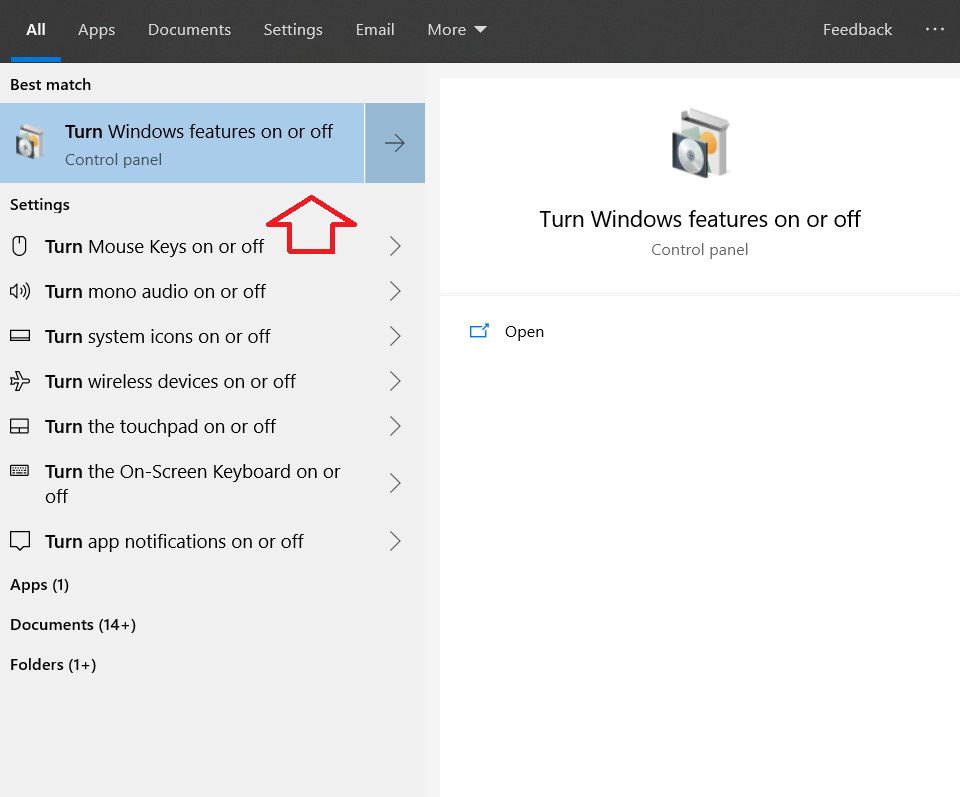
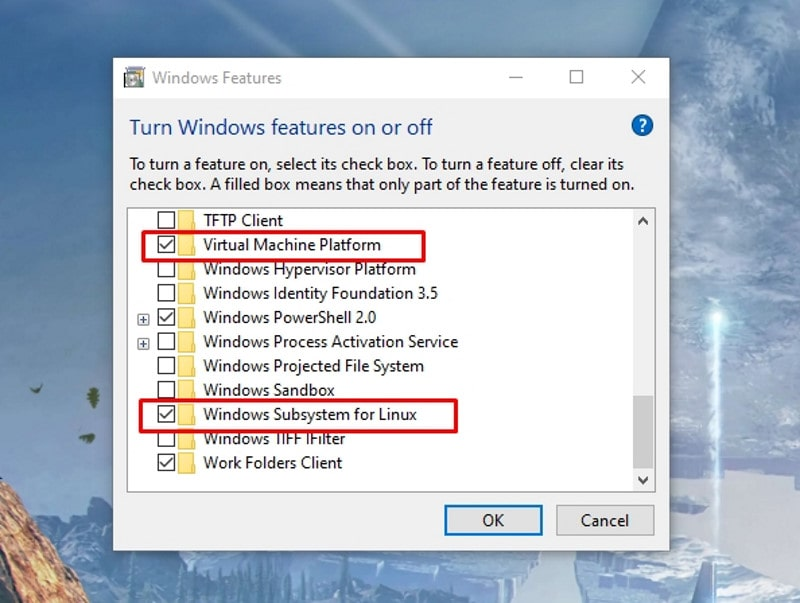
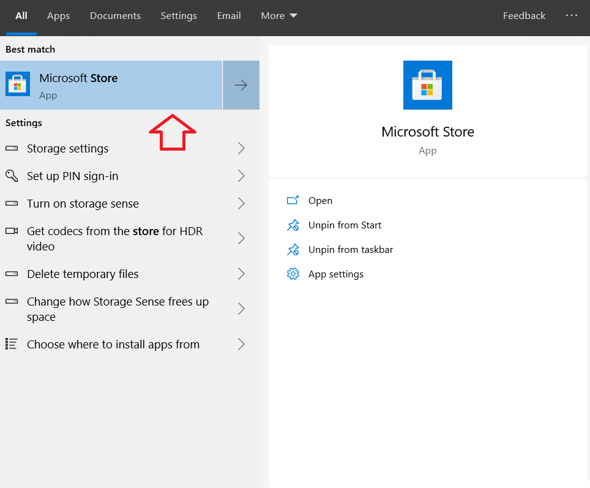
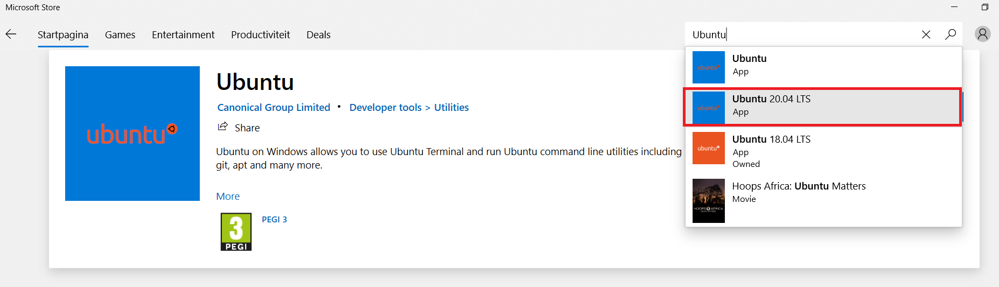

Linux in Windows 10
*******************
This tutorial explain steps to install a Linux kernel 'Windows Subsystem for Linux (WSL)' - Ubuntu in your Windows 10 Computer.

WSL provides a Windows subsystem with Ubuntu (or other distros like SUSE) Linux runs atop it. It is not a virtual machine or an application like Cygwin. It is complete Linux system inside Windows 10. It allows you to run the same Bash shell that you find on Linux. This way you can run Linux commands inside Windows without the needing to install a virtual machine, or dual boot Linux and Windows. You install Linux inside Windows like a regular application. This is a good option if your main aim is to learn Linux/Unix commands.
You can find more information `here <https://itsfoss.com/install-bash-on-windows/>`_.

Requirements
============

This feature is available only in **Windows 10**.

Installation
============

Step 1: Enable “Windows Subsystem for Linux” feature
++++++++++++++++++++++++++++++++++++++++++++++++++++

Go to start programs and type in "turn". Select "Turn Windows features on or off" as shown in figure below:

Enable (or check) the feature for **Windows Subsystem for Linux** and **Virtual Machine Platform** and then **restart** your computer to make sure you have both of them enabled. 

**RESTART** your Computer !

Step 2: Download a Linux system from the Windows store
++++++++++++++++++++++++++++++++++++++++++++++++++++++

Once your system has restarted, go to the Windows Store and search for “Ubuntu”.

Select **Ubuntu 20.04 LTS** and install it by clicking on "Get" button on top right.
You need to be connected to internet for the computer to download the Ubuntu distro and install in your computer.

Step 3: Run Linux inside Windows 10
+++++++++++++++++++++++++++++++++++

Once you have installed Linux, Let us run it inside the Windows.

Just search for Ubuntu in the Start programs. Click on Ubuntu which will open a command line terminal as shown below. You’ll see that it runs like a normal Windows application.
Only the first time, it will take some time to setup and it will also ask you to set up a username and a password.

.. warning::

   Password will not appear in the terminal (command line)

Now you are ready to use Linux inside Windows 10.

Additional Software
===================

MobaXterm
+++++++++

MobaXterm is a X server which enables user interface features for programs installed in Linux (Ubuntu) within Windows 10 in this case.

Go to this `link <https://itsfoss.com/install-bash-on-windows/>`_, download the home edition and install MobaXterm with default settings. 

Spatial libraries in ubuntu
+++++++++++++++++++++++++++

Now let us also install some spatial libraries required for data processing in Ubuntu.

Go to Start programs and open Ubuntu terminal.

.. code-block:: bash
   :linenos:

   # Run the following commands to install gdal, proj, grass etc.
   sudo add-apt-repository ppa:ubuntugis/ubuntugis-unstable
   sudo apt-get update
   sudo apt-get install grass grass-gui grass-core grass-doc grass-dev
