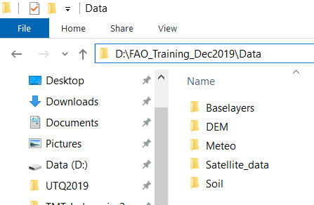
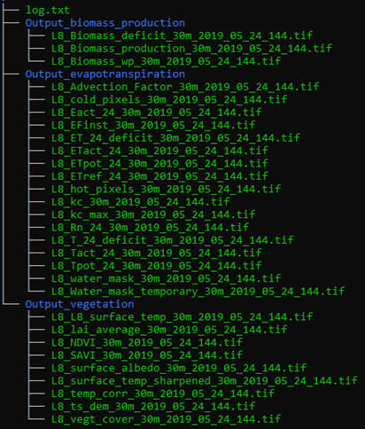

PySEBAL data preparation and execution
**************************************

Input data preparation
======================

Let us now arrange all the data we prepared to Run PySEBAL and prepare a input excel sheet.

Assuming that you have following folder structure (recommended) for input data:

   
   Folder structure of input data

Open the excel sheet provided to you - ``D:\PySEBAL_dev\docs\InputEXCEL_v3_3_7_WIN.xlsx`` and make necessary changes to the excel sheet as listed below.

**Sheet 1: General Input**

* **InputMap** - set the path to your satellite data
* **OutputMap** - Where you want to save PySEBAL outputs (if not existing, PySEBAL will create the folder)
* **Image_type** - satellite type
* **NameDEM** - set the path to DEM file (Note that you need to provide the file name with extension(.tif))

**Sheet 2: Meteo_Input**

* **Temp_inst** - set the path to instantaneous air temperature (including file name and extension)
* **Temp_24** - set the path to daily average air temperature (including file name and extension)
* **RH_inst** - set the path to instantaneous Relative humidity (including file name and extension)
* **RH_24** - set the path to daily average Relative humidity (including file name and extension)
* **Wind_inst** - set the path to instantaneous wind speed (including file name and extension)
* **Wind_24** - set the path to daily average wind speed (including file name and extension)
* **Rs_inst** - set the path to instantaneous downward shortwave radiation (including file name and extension)
* **Rs_24** - set the path to daily downward shortwave radiation (including file name and extension)

**Sheet 3: Soil_Input**

* **Saturated soil moisture content** - set the path with filename and extension
* **Saturated soil moisture content subsoil** - set the path with filename and extension
* **Residual soil moisture content** - set the path with filename and extension
* **Residual soil moisture content subsoil** - set the path with filename and extension
* **Field_Capacity** - set the path with filename and extension
* **Wilting point** - set the path with filename and extension

**Sheet 4: Landsat_Input**

* **Name Landsat Image** - Name of the landsat image bands (for example without ``_B1.TIF``)
* **Landsat Number** - 4/5/7/8 depending which landsat
* **Bands Thermal** - 1/2, In case of Landsat 8, it is 2
* **tscold_min** - Min percentile to compute minimum threshold for cold pixel from temperature layer (Default is 5)
* **tscold_max** - Max percentile to compute maximum threshold for cold pixel from temperature layer (Default is 10)
* **ndvihot_low** - Min percentile to compute minimum threshold from NDVI layer (Default is 2)
* **ndvihot_high** - Max percentile to compute maximum threshold from NDVI layer (Default is 5)
* **temp_lapse_rate** - Temperature lapse rate for correction of surface temperature

.. note::

   Number of Rows in the input excel sheet is equal to the number of landsat images you want to process. If you have 10 images, the row numbers are from 2 to 11.

Once the input excel sheet is ready, open the Run SEBAL python file (``Run_py3.py``) which is in ``D:\PySEBAL_dev\SEBAL`` folder.

Open the file ``Run_py3.py`` in Notepadd++.

**Edits in Run_py3 file**

We need to make following changes in this file:

* **Line 14** - Set the path to prepared excel sheet
* **Line 15/16** -Set start and end row numbers for running all the landsat images in one go.

Run PySEBAL
===========

Once you made the changes save and close the file ``Run_py3``

Now open **new** **OSGeo4W Shell** and cd to ``PySEBAL_dev\SEBAL`` folder and run the following command.

.. code-block:: python
   :linenos:

   python Run_py3.py

.. note::

   In the **Sheet 4: Landsat_Input** of the input excel sheet we have to set NDVI and Temperature min and max percentile thresholds for cold and hot pixels. As a rule of thumb, we can use 5th and 10th percentile from corrected surface temperature as low and high cold pixel thresholds. We use 2nd and 5th percentile from NDVI as low and high hot pixel thresholds. If the ETa results are not desirable with the default values, you may want to try different combinations. Also for a specific region, one set of values seems to work.

Output data structure
=====================

Once the PySEBAL run successfully, you will find following structure in the output folder (one set in the excel sheet !)

   
   Folder structure of output data

Details of the output data
==========================

Once the PySEBAL run successfully, you will find following data in the output folder (one set in the excel sheet !)

**log.txt** - All the constants and derived thresholds are stored here

**Folder 1: Output_biomass_production**

* **L8_Biomass_production_30m_2014_03_10_069.tif** - Biomass production (Kg/ha)
* **L8_Biomass_wp_30m_2014_03_10_069.tif** - Biomass Water Productivity WPb (Kg/m3)
* **L8_Biomass_deficit_30m_2014_03_10_069.tif** - Deficit Biomass production (Kg/ha)

**Folder 2: Output_evapotranspiration**

* **L8_Advection_Factor_30m_2014_03_10_069.tif** - Advection factor (unitless)
* **L8_EFinst_30m_2014_03_10_069.tif** - instantaneous Evaporative Fraction (unitless)
* **L8_ET_24_deficit_30m_2014_03_10_069.tif** - 24 hours ET deficit (mm/day)
* **L8_ETact_24_30m_2014_03_10_069.tif** - 24 hours Actual EvapoTranspiration (mm/day)
* **L8_ETpot_24_30m_2014_03_10_069.tif** - 24 hours Potential EvapoTranspiration (mm/day)
* **L8_ETref_24_30m_2014_03_10_069.tif** - 24 hours Reference EvapoTranspiration (mm/day)
* **L8_Eact_24_30m_2014_03_10_069.tif** - 24 hours Actual Evaporation (mm/day)
* **L8_T_24_deficit_30m_2014_03_10_069.tif** - 24 hours Deficit Transpiration (mm/day)
* **L8_Tact_24_30m_2014_03_10_069.tif** - 24 hours Actual Transpiration (mm/day)
* **L8_Tpot_24_30m_2014_03_10_069.tif** - 24 hours Potential Transpiration (mm/day)
* **L8_cold_pixels_30m_2014_03_10_069.tif** - Detected cold pixels (unitless) 
* **L8_hot_pixels_30m_2014_03_10_069.tif** - Detected hot pixels (unitless) 
* **L8_kc_30m_2014_03_10_069.tif** - Crop coefficient Kc (unitless) 
* **L8_kc_max_30m_2014_03_10_069.tif** - Max Crop coefficient Kc (unitless) 
* **L8_water_mask_30m_2014_03_10_069.tif** - Water mask (unitless) 

**Folder 3: Output_vegetation**

* **L8_L8_surface_temp_30m_2014_03_10_069.tif** - TOA temperature (Kelvin)
* **L8_NDVI_30m_2014_03_10_069.tif** - Normalized Diffrence Vegetation Index (unitless)
* **L8_SAVI_30m_2014_03_10_069.tif** - Soil Adjusted Vegetation Index (unitless)
* **L8_lai_average_30m_2014_03_10_069.tif** - Leaf Area Index (unitless)
* **L8_surface_albedo_30m_2014_03_10_069.tif** - Surface albedo (unitless)
* **L8_surface_temp_sharpened_30m_2014_03_10_069.tif** - Sharpened Temperature using NDVI (Kelvin)
* **L8_temp_corr_30m_2014_03_10_069.tif** - Surface Temperature (Kelvin)
* **L8_ts_dem_30m_2014_03_10_069.tif** - DEM corrected Temperature (Kelvin)
* **L8_vegt_cover_30m_2014_03_10_069.tif** - vegetation cover (unitless)
